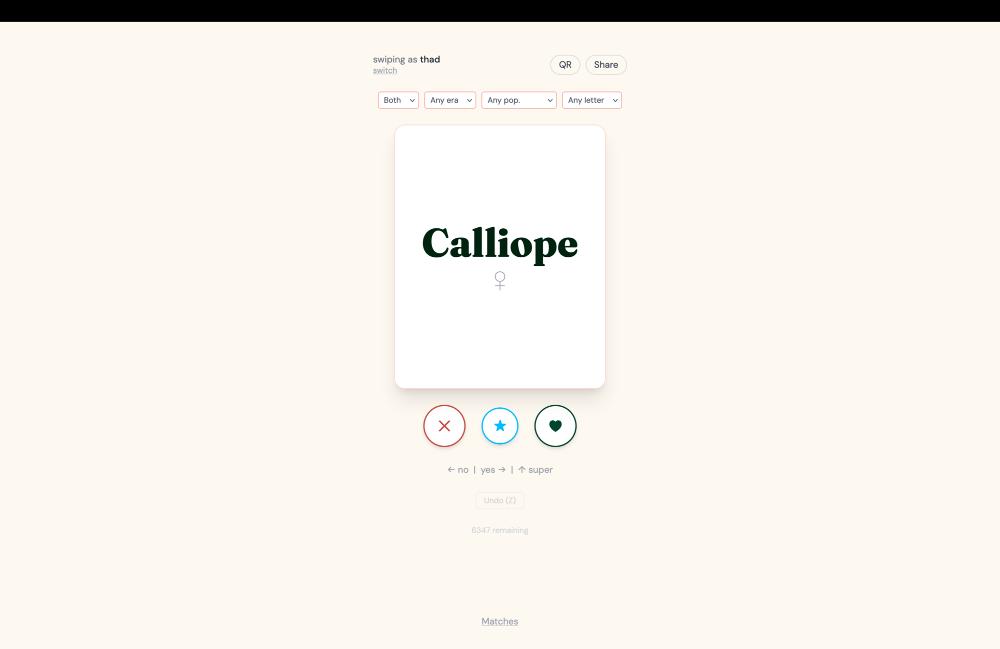

# Bramble

[](https://github.com/lxhwes/bramble/releases)
[](https://github.com/lxhwes/bramble/actions/workflows/ci.yml)
[](https://github.com/lxhwes/bramble/pkgs/container/bramble)
[](LICENSE)

A free, open-source baby name matching app for parents, couples, or anyone. Swipe independently, find mutual matches.

**Bramble is built to be self-hosted.** One container, one SQLite file, no accounts and no external services — `docker compose up -d` and it's yours. There's a [live demo](#live-demo) if you'd rather look before you run anything.



## Run it

### Prerequisites

- Docker Engine 24 or newer
- Docker Compose v2.24 or newer — check with `docker compose version`. The compose file uses `env_file:` with `required: false`, which older releases reject.

### Quick start

No clone and no build — grab the compose file and start it:

```bash
curl -O https://raw.githubusercontent.com/lxhwes/bramble/main/docker-compose.yml
docker compose up -d
```

Bramble is then on <http://localhost:3000>. Images are published to [GHCR](https://github.com/lxhwes/bramble/pkgs/container/bramble) for `linux/amd64` and `linux/arm64`.

For anything you care about, pin a version rather than tracking `latest` — set `image: ghcr.io/lxhwes/bramble:0.1.0` in the compose file. Under 0.x a minor release may break compatibility, which is why there is deliberately no moving `:0` tag to follow. What changed in each release, and anything you have to do before pulling it, is in the [changelog](CHANGELOG.md).

### Configuration

Copy [`.env.example`](.env.example) to `.env` and edit it. Everything set there reaches the container.

For any deployment other than `http://localhost:3000`, **set `ORIGIN` to the URL people will actually visit.** Getting it wrong is the most common self-host problem: session create breaks while swiping keeps working. See [Troubleshooting](docs/SELF-HOSTING.md#troubleshooting).

| Variable | Required | Default | Purpose |
|---|---|---|---|
| `ORIGIN` | yes | `http://localhost:3000` (via compose) | Full origin URL (e.g. `https://names.example.com`) — needed for CSRF on form POSTs (session create, shortlist add/remove). Compose defaults to localhost; override it for any non-local deployment |
| `BRAMBLE_DB_PATH` | no | `/data/bramble.sqlite` | Path to the SQLite database file |
| `PORT` | no | `3000` | Port the HTTP server listens on |
| `BRAMBLE_RETENTION_DAYS` | no | `90` | Inactive-session prune window in days |
| `ADDRESS_HEADER` | no | — | Header to read client IP from (e.g. `X-Forwarded-For`) when behind a reverse proxy |
| `XFF_DEPTH` | no | — | Number of trusted reverse proxies in the `X-Forwarded-For` chain |
| `BRAMBLE_MIGRATIONS_DIR` | no | `/app/migrations` (in the image) | Directory holding the SQL migration files |
| `BRAMBLE_TARGET` | build-time only | `cloudflare` | Selects the adapter and is baked into the bundle at build time. The published image is already built with `node`; setting it at runtime changes nothing |

Migrations run automatically — lazily, on the first request after startup rather than at boot. There is no separate migrate step.

### Running it for real

Putting it on a domain, backing it up, keeping it pruned and upgraded: **[docs/SELF-HOSTING.md](docs/SELF-HOSTING.md)**.

Two things are worth knowing before you leave it running unattended. Nothing prunes and nothing is backed up until you [add the cron jobs](docs/SELF-HOSTING.md#scheduled-jobs) yourself, and `docker compose down -v` deletes the volume and every session in it.

### Building from source instead

```bash
git clone https://github.com/lxhwes/bramble.git
cd bramble
docker compose -f docker-compose.yml -f docker-compose.build.yml up -d --build
```

The first build compiles `better-sqlite3` from source and takes a few minutes; later builds reuse the layer cache. There is no dataset step — `static/names.json` is committed. `pnpm build:names` exists only for regenerating it from the upstream sources, which self-hosting never requires.

## Features

- Anonymous, URL-shared sessions — no signup, no accounts, no PII
- ~6,300 names from SSA + Behind the Name
- Independent swiping with live mutual-match toasts
- Filters: gender, era, popularity, starts-with letter (filter state survives reload)
- Resume mid-deck, undo last 5 swipes, tap-to-vote alongside swipe + keyboard
- Shortlist mode — pin favorites, export as JSON or printable HTML
- Stats page — like rate, mutual likes, disagreements
- Installable PWA with offline cache
- QR code + Web Share API for in-person handoff

### What a self-hosted instance collects

Nothing. There are no accounts, no PII, and no analytics or telemetry of any kind on the self-hosted build — no beacon, no token, nothing to opt out of. Votes live in your SQLite file and are pruned after `BRAMBLE_RETENTION_DAYS` of inactivity.

The one caveat worth stating plainly: the app currently loads its two webfonts from Google Fonts, so a self-hosted page does make that third-party request. Fixing it by [self-hosting the fonts](https://github.com/lxhwes/bramble/issues/17) is tracked and open.

## Why

Existing name apps charge for the swipe-and-match feature, even though the underlying data is largely public. Bramble is a free alternative built on open datasets:

- US Social Security Administration — name frequencies back to 1880 (public domain)
- Behind the Name — name origin and related names (CC BY-SA 4.0)

## Live demo

[bramble.oovoid.com](https://bramble.oovoid.com) — a real instance you can swipe on without installing anything.

It runs on the maintainer's Cloudflare Pages account, which is where Bramble started before self-hosting became the point. It is kept alive as a demo, not as the deployment path this project recommends: it needs a Cloudflare account, D1, KV, and dashboard-configured WAF rules, none of which the Docker image asks of you. Self-host is the path that gets the documentation and the releases.

## How it's built

SvelteKit + TypeScript + Tailwind, building to two targets selected by `BRAMBLE_TARGET` at build time:

- **Docker / Node** (`BRAMBLE_TARGET=node`) — the maintained deployment path and what the published image is. `better-sqlite3` SQLite file for votes and session meta, in-process rate limiter.
- **Cloudflare Pages** (`BRAMBLE_TARGET=cloudflare`) — the demo instance above. D1 for vote storage, KV for hot session state, edge WAF for rate limiting.

The variable still defaults to `cloudflare`, which is a leftover from the pre-pivot layout rather than a statement about which target matters — [#33](https://github.com/lxhwes/bramble/issues/33) tracks flipping it. Storage sits behind a `getStorage()` seam, so the two targets share their business-logic SQL; [docs/ARCHITECTURE.md](docs/ARCHITECTURE.md) has the full feature matrix.

The name dataset is preprocessed at build time into a static JSON blob — no runtime API calls.

## Development

```bash
pnpm install
```

### Node / self-host target

The maintained path, so develop against it by default. `BRAMBLE_TARGET` is read at build time, which includes the dev server:

```bash
BRAMBLE_TARGET=node BRAMBLE_DB_PATH=./data/bramble.sqlite pnpm dev
```

Migrations apply to that SQLite file on the first request. For a production-shaped run instead of the dev server:

```bash
pnpm build:node
BRAMBLE_DB_PATH=./data/bramble.sqlite ORIGIN=http://localhost:3000 PORT=3000 node build/index.js
```

PWA flows need a production build — the service worker is not registered in dev. Use the `pnpm build:node` command above rather than `pnpm preview`, which serves the Cloudflare bundle.

To test your change in the container, layer the build file over the compose file. A bare `docker compose up` pulls the published image and would validate the last release instead of your branch:

```bash
docker compose -f docker-compose.yml -f docker-compose.build.yml up --build
```

### Cloudflare target

Only needed when working on the demo instance:

```bash
pnpm db:migrate:local  # apply D1 migrations to the local emulator
pnpm dev               # Vite dev server with local KV + D1 via wrangler
```

### Quality gate

```bash
pnpm lint              # Biome
pnpm check             # wrangler types + svelte-check (zero warnings)
pnpm test              # Vitest
pnpm build:node        # both targets must stay green
pnpm build:cf
```

`pnpm build:names` regenerates `static/names.json` from the upstream sources — see [docs/DATA.md](docs/DATA.md). It is only needed when changing the dataset itself.

## Project status

Released and in daily use. v0.1.0 is the first tagged release, not a half-finished one — it's the first time the self-host contract was written down and tagged. See the [changelog](CHANGELOG.md) for what that means for upgrades.

Bramble is deliberately small and feature-complete for now — the roadmap's later phases are parked, not scheduled. Bug fixes, docs, and self-hosting improvements are welcome as PRs with no preamble. For anything larger, open an issue first; the bar for un-parking a phase is real demand, not a good idea.

## Contributing

See [CONTRIBUTING.md](CONTRIBUTING.md) for the full guide. The short version: follow [Conventional Commits](https://www.conventionalcommits.org/) and make sure `pnpm lint && pnpm check && pnpm test` passes before opening a PR.

## Project docs

- [docs/SELF-HOSTING.md](docs/SELF-HOSTING.md) — operating an instance: proxies, backups, cron, upgrades, troubleshooting
- [CHANGELOG.md](CHANGELOG.md) — what changed in each release, and upgrade notes
- [docs/ARCHITECTURE.md](docs/ARCHITECTURE.md) — stack decisions and the Cloudflare-vs-Node feature matrix
- [docs/DATA.md](docs/DATA.md) — where the name dataset comes from and how to rebuild it
- [docs/ROADMAP.md](docs/ROADMAP.md) — phased plan
- [docs/BRAND.md](docs/BRAND.md) — palette and icon regeneration
- [SECURITY.md](SECURITY.md) — threat model and how to report a vulnerability
- [CODE_OF_CONDUCT.md](CODE_OF_CONDUCT.md)
- [docs/history/](docs/history/) — task lists for shipped phases, kept for context

## License

- App code: MIT — see [LICENSE](LICENSE).
- Bundled name dataset (`static/names.json`): CC BY-SA 4.0 — see [LICENSE-DATA.md](LICENSE-DATA.md).

Name data comes from the [US Social Security Administration](https://www.ssa.gov/oact/babynames/) (public domain) and [Behind the Name](https://www.behindthename.com/) (CC BY-SA 4.0). Attribution is rendered in-app on the About page and ships beside the data at `/names.LICENSE.txt`. Share-alike is viral, so if you redistribute the dataset — including by publishing a container image — that attribution has to travel with it.
